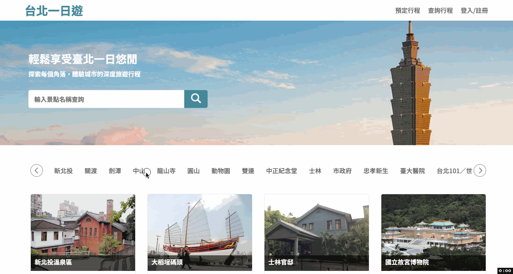
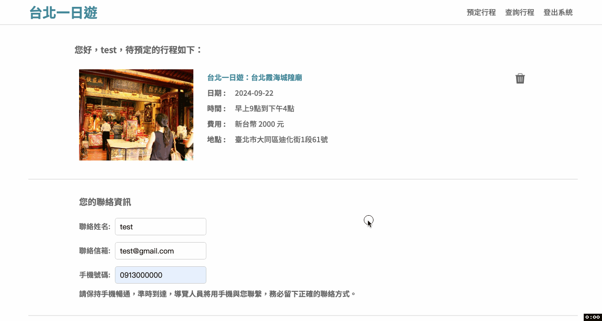

# 👋 Hi there, I'm Yen-Ju Liu

## 🚀 About Me
- 👨‍💻 Backend engineer with a Computer Science background
- 🌱 Passionate learner and enjoys problem-solving

## 📞 Contact
- 👤 **Yen-Ju Liu**
- 📧 Email: cat821016@gmail.com
- 💼 [LinkedIn](https://www.linkedin.com/in/ruru88/)

## 🏆 Featured Project: Taipei Day Trip
A comprehensive travel planning and booking platform that streamlines trip scheduling for tourists.

### 🌟 Key Features
- Attraction search and booking system
- Secure payment integration
- Real-time availability checking
- User authentication and profile management

### 🛠 Technical Highlights
- **Cloud Infrastructure**: 
  - AWS EC2 for deployment with Docker containerization
  - AWS S3 with CDN for optimized image delivery
  - AWS RDS (MySQL) for database management
- **Backend**: 
  - FastAPI for high-performance RESTful APIs
  - Redis caching for enhanced system performance
- **Frontend**: 
  - Responsive design with HTML5, CSS3, and JavaScript
  - Interactive UI for seamless user experience

## 🛠 Languages and Tools:

   
     
     
     
     
     
     
      

### 🔗 Live Demo

### Demo Account

- Email: test@gmail.com
- Password: 111111

#### Test Credentials

- Number: 4242 4242 4242 4242
- Exp: 04/30
- Pwd: 123

    
  

     

  

  

